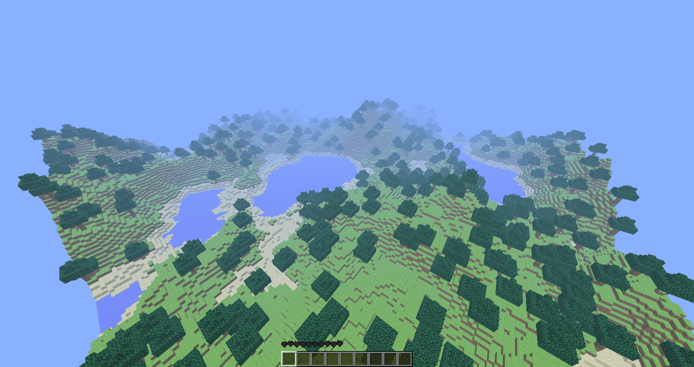

### What is it?
This repository is a clone of game Minecraft created with C++ and Python 3.7

### How to run?
To build this project you have to download boost 1.68.0 and compile boost.python by yourself for your os.
Next you have to add location of compiled libs into your system path. Before that you need to install Python 3.7.
Also you need to install pyopengl, pyglet, numpy and pygame for your python. For c++ you need to install GLEW, OPENGL

### Example how to compile boost.python x64 for windows and mingw
This worked for me, but it may not work for you. So if it is, you have to find the way to compile it.
```MS-DOS Batch
bootstrap gcc
b2 -j12 toolset=gcc runtime-link=shared architecture=x86 address-model=64 --with-python cxxflags="-D__int64=\"long long int\" -DBOOST_REGEX_MATCH_EXTRA -D__NO_INLINE__ -D_hypot=hypot"  --build-type=complete --layout=tagged stage
```

# Screenshots
### Game

